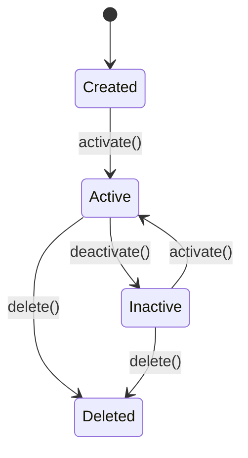

# AGENTS

이 문서는 프로젝트 내 모든 .md 파일의 내용을 한 곳에 모아 정리한 것입니다.

## Index
- [CLAUDE.md](#CLAUDEmd)
- [README.md](#READMEmd)
- [commands/readme.md](#commands-readmemd)
- [commands/setup.md](#commands-setupmd)
- [specs/ai_agents.md](#specs-ai_agentsmd)
- [specs/ai_response.md](#specs-ai_responsemd)
- [specs/comments.md](#specs-commentsmd)
- [specs/git.md](#specs-gitmd)
- [specs/readme.md](#specs-readmemd)
- [specs/security.md](#specs-securitymd)
- [workflows/internalize.md](#workflows-internalizemd)
- [workflows/main.md](#workflows-mainmd)
- [workflows/planning.md](#workflows-planningmd)
- [workflows/spec.md](#workflows-specmd)
- [workflows/tdd.md](#workflows-tddmd)

## CLAUDE.md

# CLAUDE.md

@specs/ai_response.md

@specs/git.md
@specs/security.md
@specs/comments.md

@workflows/main.md

## README.md

# my-claude-code-config

Claude Code 전역 설정 파일 모음

## 설치

```bash
git clone https://github.com/rakjija/my-claude-code-config.git
cd my-claude-code-config
./install.sh
```

## 구조

```
├── CLAUDE.md         # 전역 설정
├── specs/            # 규칙 + 문서 형식
│   ├── ai_response.md
│   ├── git.md
│   ├── security.md
│   ├── readme.md
│   └── ai_agents.md
├── workflows/        # 개발 프로세스
│   ├── main.md
│   ├── planning.md
│   ├── spec.md
│   ├── tdd.md
│   └── internalize.md
└── commands/         # 슬래시 커맨드
    ├── setup.md      # /setup - 프로젝트 초기화
    └── readme.md     # /readme - README 생성/수정
```

## 사용법

### 전역 규칙

`install.sh` 실행 후 자동 적용

### 프로젝트 초기화

```bash
# Claude Code에서 실행
/setup
```

생성되는 구조:

```
project/
├── README.md      # 프로젝트 문서 + AI 규칙
├── AGENTS.md      # @README.md
├── CLAUDE.md      # @AGENTS.md
└── GEMINI.md      # @AGENTS.md
```

## commands/readme.md

README.md 생성/업데이트:

@specs/readme.md

## 절차

1. 프로젝트 분석
2. README.md 없으면 → 템플릿 기반 생성
3. README.md 있으면:
   - 누락 섹션 추가
   - 오래된 내용 수정
   - 기존 AGENTS.md, CLAUDE.md, GEMINI.md 내용 → README.md로 병합

## 규칙

- 간결하게 유지
- 코드와 일치하지 않는 내용 수정
- 불필요한 뱃지/장식 금지

## commands/setup.md

프로젝트 구조 설정/마이그레이션:

## 구조

```
project/
├── README.md          # 프로젝트 문서 + AI 규칙
├── AGENTS.md          # @README.md
├── CLAUDE.md          # @AGENTS.md
└── GEMINI.md          # @AGENTS.md
```

## 형식

### README.md

@specs/readme.md

### AGENTS.md / CLAUDE.md / GEMINI.md

@specs/ai_agents.md

## 절차

1. README.md, 프로젝트 설정 파일 확인
2. README.md 처리: @commands/readme.md
3. AGENTS.md 생성
4. CLAUDE.md 생성
5. GEMINI.md 생성

## specs/ai_agents.md

# AI Agents 설정

## AGENTS.md

### 형식

```markdown
@README.md

# Rules

- 한글 응답
- 간결하게, 질문에만 답변
- 불명확하면 먼저 질문
- 코드 수정 시 "무엇을/왜" 설명
```

## CLAUDE.md

### 형식

```markdown
@AGENTS.md
```

## GEMINI.md

### 형식

```markdown
@AGENTS.md
```

## specs/ai_response.md

# AI Response

## 대화

- 한글 응답
- 간결하게, 질문에만 답변
- 불명확하면 먼저 질문

## 코드 수정

- "무엇을/왜" 바꾸는지 간단히 설명 후 바로 수정
- 승인 대기 X, 플랜만 제시 X

Format:

```
▶ **WHAT ?**

- 변경 전/후 코드 비교

▶ **WHY ?**

- 현재 문제
- 해결
- 효과
```

## specs/comments.md

# Comments

- "왜(Why)"만 설명, 코드로 표현 가능하면 주석 X
- Better Comments 형식: ! (경고), ? (검토), TODO, * (강조)
- 함수에는 주석 필수 (목적, 파라미터, 반환값)

## specs/git.md

# Git

## 작업 순서

테스트 → 린팅/포매팅 → 빌드 → 커밋 → 푸시

## 커밋 메시지

- Conventional Commits 형식 사용
- Claude 서명 제거

## specs/readme.md

# README.md

## 형식

```markdown
# (프로젝트명)

(설명..)

## 개발 환경

- 언어/버전: (예: Node.js 22 LTS, Python 3.12, Go 1.23)
- 패키지 매니저: (예: pnpm, uv, go modules)
- 린터/포매터: (예: Biome, Ruff, golangci-lint)
- 테스트: (예: pnpm test, pytest, go test ./...)

## 사용법

- (설치 방법, 테스트 등등..)

## 작업 규칙

- (프로젝트별 주의사항. 인간, AI 공통 참조)

## 금지사항

- dist/, node_modules/ 수정
- 기존 테스트 삭제
- 민감 정보 커밋
- 한글 변수명
- (기타 등등..)
```

## specs/security.md

# Security

## 커밋 금지

- `.env*`, `credentials.json`, `secrets.json`
- `*.pem`, `*.key`
- API 키, 토큰, 비밀번호 포함 파일

## 코드 작성

- 하드코딩된 비밀값 금지
- 환경변수 또는 시크릿 매니저 사용

## workflows/internalize.md

# Internalize

## 목적

AI가 생성한 코드를 자신의 역량으로 만들기 위한 체계적 학습 프로세스

## 내재화란?

**코드를 "아는 것"과 "이해하는 것"의 차이:**

```
그냥 아는 상태:
"이 코드가 뭐 하는 건지 알아요" → 설명 못함

내재화된 상태:
"이 코드가 왜 이렇게 동작하고,
 언제 쓰고, 어떻게 수정할 수 있는지" 알 수 있음
```

---

## 퀴즈 방식: 2단계 프로세스

### 단계 1: 주요 포인트 퀴즈

**목적**: 핵심만 파악하기

**진행 방식:**

1. 질문은 **한 번에 하나씩**
2. 사용자 답변 후 → 짧은 피드백 → 다음 질문
3. 전체 3~4개 질문으로 제한

**질문 예시:**

- "이 함수의 입력과 출력이 뭐야?"
- "여기서 뭐가 일어나?"
- "왜 이 조건문이 필요해?"
- "이 함수가 어디서 호출돼?"

**중요: Claude는 질문만 하고, 사용자 답변을 기다린다. 스스로 답하지 않는다.**

**예시 대화:**

```
Claude: 자가 리뷰 시작합니다.

Q1. 이번 변경에서 핵심 로직이 뭐야?

User: API 호출 후 결과를 캐싱하는 거

Claude: 맞아. 그럼 Q2. 캐시 만료는 어떻게 처리해?
```

### 단계 2: 전체 포인트 해설

**목적**: 완전한 이해로 다지기

Claude의 상세 해설:

- 입력 → 처리 → 출력 전체 흐름 설명
- 디버거로 변수 값 추적하며 확인
- 호출부 3개 따라가며 실제 사용 패턴 이해

**특징:**

- 퀴즈의 정답 + 추가 맥락
- "왜"에 대한 설명 포함
- 실습(디버거)과 함께 진행

---

## 예시: Terraform 코드

### 상황

```hcl
resource "aws_rds_db_instance" "main" {
  identifier           = var.db_identifier
  allocated_storage   = var.allocated_storage
  engine              = "postgres"
  instance_class      = var.instance_class
  username            = var.db_username
  password            = random_password.db_password.result

  skip_final_snapshot = true

  tags = {
    Environment = var.environment
  }
}

resource "random_password" "db_password" {
  length  = 16
  special = true
}
```

### 퀴즈 방식 대화

**Claude**: "이 코드가 전체적으로 뭐를 하는 거 같아?"

**너**: "아 AWS RDS 데이터베이스를 만드는 거네요"

**Claude**: "맞아! 그럼 `random_password.db_password.result`가 뭘 하는 거야?"

**너**: "어... 뭐 뭔가 random을 쓰는 건데..."

**Claude**: "좋은 질문이야. 이게 RDS의 비밀번호를 자동 생성하는 거야. 왜 이렇게 할까?"

**너**: "아, 사람이 수동으로 비밀번호를 정하면 보안 위험이니까, 자동으로 생성하는 거네!"

**Claude**: "정확해! 그럼 이 비밀번호는 어디에 저장돼?"

**너**: "음... Terraform state 파일?"

**Claude**: "좋아! 그래서 실무에선 이 state 파일을 원격으로(S3) 관리하고, 접근을 제한해. 왜 그럴까?"

**너**: "아 비밀번호가 평문으로 저장되니까 누가 접근하면 위험하니까!"

---

## DevOps 특화 내재화

### IaC 코드의 특수성

**일반 애플리케이션 코드:**

```
입력 → 복잡한 로직 → 출력
(로직 이해가 핵심)
```

**IaC 코드 (Terraform, Helm):**

```
선언 → 리소스 생성 → 상태 관리
(리소스 관계와 의존성이 핵심)
```

### 퀴즈 방식 적용

**리소스 관계 파악:**

- "이 리소스가 어디에 의존해?"
- "이 변수가 몇 군데에서 쓰여?"
- "순서가 중요한 리소스는?"

**실제 동작 추적:**

```bash
terraform plan  # 뭐가 생성/수정/삭제되는지 보기
terraform apply # 실제 동작 확인
```

디버거 대신 `terraform plan`과 AWS 콘솔을 보며 이해

---

## 체크리스트

### 퀴즈 단계 후

- [ ] "입력/출력이 뭔지" 설명 가능한가?
- [ ] "중간에 뭐가 일어나는지" 설명 가능한가?
- [ ] "왜 이 조건이 필요한지" 설명 가능한가?

### 해설 단계 후

- [ ] 디버거/plan으로 전체 흐름을 봤는가?
- [ ] 호출부(또는 의존 리소스) 3개를 따라갔는가?
- [ ] "이 코드를 비슷하게 다른 곳에 쓸 수 있을까?" 생각해봤는가?

### 최종 확인

- [ ] 누군가 "이 코드 설명해봐"라고 하면 바로 설명 가능한가?
- [ ] 관련된 버그가 생기면 원인을 빨리 찾을 것 같은가?
- [ ] 비슷한 패턴을 다음번엔 AI 없이 직접 쓸 수 있을 것 같은가?

마지막 세 개 다 "네"면 내재화 완료.

---

## 자주 하는 실수

### 1. "코드 읽기"만 하기

❌ 파일을 열고 줄 단위로 읽음
✅ 디버거/plan으로 "실제 동작"을 따라가기

### 2. "모든 세부사항" 이해하려 하기

❌ 주석 하나하나까지 이해하려 함
✅ "입력 → 처리 → 출력" 핵심만 파악

### 3. 퀴즈 스킵하고 해설만 듣기

❌ "설명 좀 해줘" → 끝
✅ 스스로 생각해본 후 → 해설 들으며 검증

### 4. 한 번에 "완벽하게" 이해하려 하기

❌ 한 번에 다 이해 못 하면 포기
✅ 1차: 흐름만, 2차: 디테일, 3차: 수정해보기 (여러 번)

---

## 팁

IaC 코드는 선언적이라:

- 코드 양이 적음
- 로직이 복잡하지 않음
- 결과(AWS 콘솔)가 바로 보임

→ 일반 애플리케이션 코드보다 내재화가 빠름

---

## 예상 소요 시간

| 단계          | 시간        | 주요 작업             |
| ------------- | ----------- | --------------------- |
| 퀴즈          | 5~10분      | Claude 질문에 답하기  |
| 해설 + 디버거 | 5~10분      | 흐름 확인 + 변수 추적 |
| 호출부 확인   | 3~5분       | 3개 호출부 따라가기   |
| **총**        | **15~25분** |                       |

비교: 그냥 "이 코드를 설명해줘"는 30분 이상 걸리는데도 이해도 낮음.

---

## 다음 단계

내재화 완료 → workflow의 "커밋/푸시" 진행

## workflows/main.md

# Workflow

## 피처 개발

### 1. 기획

@workflows/planning.md 참고

### 2. 스펙 정의

@workflows/spec.md 참고

### 3. 테스트 작성 (TDD RED)

@workflows/tdd.md 참고

### 4. 개발 (TDD GREEN + REFACTOR)

AI 코드 생성 시 내재화 프로세스 적용:

**즉시 이해**

- 블록(함수/섹션) 단위로 "이 부분이 뭐 하는 건지" 설명 제안
- 호출부 흐름도 함께 안내
- 사용자가 이해 못하면 추가 설명

**설명 포함 항목**

- 입력값, 출력값
- 중간 처리 로직
- 조건문/루프 분기 이유
- 호출부 위치와 사용 방식

### 5. 테스트 실행

- 테스트 통과 확인

### 6. 린팅/포매팅

@specs/git.md 참고

### 7. 빌드

- 빌드 성공 확인

### 8. AI 코드 리뷰

Codex CLI 사용:

```bash
# 커밋 전 변경사항 리뷰
codex review --uncommitted

# 특정 브랜치 대비 리뷰
codex review --base main
```

- 보안 취약점, 버그, 성능 이슈 확인
- 지적 사항 수정 후 다시 리뷰
- 자가 리뷰 전 사전 검증

### 9. 자가 리뷰 (내재화 확인)

@workflows/internalize.md 참고

### 10. 커밋/푸시

@specs/git.md 참고

## 동료 리뷰

- "이 부분은 왜 이렇게 설계했어요?" 질문에 답할 수 있는 상태로 진입
- 막히면 리뷰어와 함께 파기 → 가장 강력한 학습

## 변형 문제 (선택)

- 비슷한 로직을 AI 없이 직접 짜보기
- 막히면 그때 AI나 기존 코드 참고
- 가장 강력한 내재화

## DevOps 우선순위

### 높음

- Terraform, Helm, 스크립트 (IaC)
- CI/CD 파이프라인
- 흐름 추적 필수

### 낮음

- 복잡한 애플리케이션 로직
- "대강 뭐 하는 건지" 정도면 OK
- 시스템 흐름 파악 > 코드 읽기

## 타임라인

```
기획 + 스펙 정의    : 30분
테스트 작성 + 개발  : 30분
테스트 실행         : 5분
린팅/포매팅/빌드    : 5분
AI 코드 리뷰        : 5분
자가 리뷰           : 5~10분
동료 리뷰           : 20~30분
────────────────────────────
총                  : 1.5~2시간
```

## 체크리스트

- [ ] 1. 기획 (@workflows/planning.md)
- [ ] 2. 스펙 정의 (@workflows/spec.md)
- [ ] 3. 테스트 작성 (@workflows/tdd.md RED)
- [ ] 4. 개발 (GREEN + REFACTOR)
- [ ] 5. 테스트 실행
- [ ] 6. 린팅/포매팅
- [ ] 7. 빌드
- [ ] 8. AI 코드 리뷰 (Codex)
- [ ] 9. 자가 리뷰 (@workflows/internalize.md)
- [ ] 10. 커밋/푸시 (@specs/git.md)

---

## 버그 수정

피처 개발보다 간소화된 버전

### 1. 문제 정의

- 뭐가 잘못됐나? (증상)
- 재현 방법은?

### 2. 원인 분석

- 왜 잘못됐나? (로그, 코드 추적)
- 근본 원인은?

### 3. 테스트 케이스

- 버그 재현 테스트 작성 (있으면)
- 수정 후 통과 확인용

### 4. 수정

- 최소 범위로 수정
- 사이드 이펙트 확인

### 5. 검증

- 테스트 실행
- 빌드 확인
- codex review --uncommitted

### 6. 자가 리뷰 (간소화)

퀴즈 1~2개:

- "이번 수정의 핵심이 뭐야?"
- "왜 이 방식으로 수정했어?"

### 7. 커밋/푸시

@specs/git.md 참고

### 버그 수정 타임라인

```
문제 정의 + 원인 분석  : 15분
수정 + 검증            : 15분
자가 리뷰              : 5분
───────────────────────────
총                     : 30~40분
```

## workflows/planning.md

# Planning

## 목적

AI 코드 생성 전에 요구사항을 명확히 정의하여 코드 품질 향상

## 체크리스트

작업 시작 전 다음을 명확히 정의:

### 1. 기능 개요

```markdown
## 기능명: [기능 이름]

**목표**: 이 기능이 달성하는 것은?

- 예: "사용자가 검색 조건으로 상품을 필터링할 수 있다"

**배경**: 왜 필요한가?

- 예: "현재 전체 목록만 보여져서 사용자 경험이 떨어짐"
```

### 2. 입출력 정의

```markdown
**입력값**:

- 파라미터 이름: 타입, 설명, 범위/제약
- 예: `searchQuery: string, maxResults: number (1-100)`

**출력값**:

- 반환값: 타입, 구조
- 예: `{ items: Item[], total: number, hasMore: boolean }`
```

### 3. 핵심 로직

```markdown
**처리 흐름**:

1. [단계 1]
2. [단계 2]
3. [단계 3]

**예외/엣지 케이스**:

- 빈 검색 결과 → []
- 인터넷 연결 끊김 → 캐시된 데이터 반환
- 중복 요청 → debounce 처리
```

### 4. 테스트 케이스

```markdown
**Happy Path**:

- [ ] 정상 입력값 → 정상 출력

**Edge Cases**:

- [ ] 빈 값 입력
- [ ] 경계값 (maxResults = 0, 100, 101)
- [ ] 특수문자 포함
- [ ] 초대형 데이터

**Error Cases**:

- [ ] 네트워크 오류
- [ ] 타임아웃
- [ ] 잘못된 형식
```

### 5. 제약사항

```markdown
**성능**:

- 응답 시간: 1초 이내
- 메모리: 50MB 이하

**보안**:

- SQL Injection 방지 필수
- 민감 정보 로깅 금지

**호환성**:

- Node.js 22 LTS 이상
- 모던 브라우저 지원 (IE 제외)
```

### 6. 의존성

```markdown
**내부 의존**:

- Database 스키마
- 기존 유틸리티 함수

**외부 의존**:

- API 호출 대상
- 라이브러리 버전
```

---

## 예시: Terraform

```markdown
## 기능명: AWS RDS 데이터베이스 생성

**목표**: IaC로 RDS 인스턴스를 자동 프로비저닝

**입력값**:

- `instance_class: string` (db.t3.micro, db.t3.small)
- `allocated_storage: number` (20-1000 GB)
- `engine_version: string` (13, 14, 15)

**출력값**:

- `endpoint: string` (호스트명)
- `port: number` (기본 5432)
- `security_group_id: string`

**처리 흐름**:

1. VPC 내 서브넷 그룹 생성
2. RDS 인스턴스 생성
3. 보안 그룹 설정 (포트 5432 허용)
4. 파라미터 그룹 설정

**테스트 케이스**:

- [ ] 기본값으로 생성 성공
- [ ] 커스텀 값으로 생성 성공
- [ ] 잘못된 instance_class → 오류
- [ ] 스토리지 범위 초과 → 오류

**제약사항**:

- Multi-AZ 비활성화 (개발 환경)
- 백업 retention: 7일
- 자동 마이너 버전 업그레이드 활성화
```

---

## DevOps 특화

### IaC 기획 포인트

**리소스 관계 명확히**:

```
VPC
  └── Subnet Group
        └── RDS Instance
              └── Security Group
```

**변수화 영역**:

- 환경별 차이 (dev, staging, prod)
- 선택 사항 (optional 리소스)
- 반복 패턴 (여러 인스턴스 생성)

**모듈화 가능성**:

- 독립적으로 재사용 가능한가?
- 다른 프로젝트에서도 쓸 수 있는가?

---

## 품질 체크

기획 완료 전 확인:

- [ ] 입출력이 완벽하게 명확한가?
- [ ] 테스트 케이스가 3개 이상인가?
- [ ] 엣지 케이스를 생각해봤는가?
- [ ] 성능/보안 제약사항은?
- [ ] "이것만으로 AI가 코드 짤 수 있을까?"

마지막 질문이 "네"라면 기획 완료.

---

## 다음 단계

기획 완료 → workflow의 2단계 "테스트 작성"으로 진행

## workflows/spec.md

# Spec

## 목적

기획(planning.md)을 코드로 변환하기 전, 기술 스펙을 명확히 정의

## 순서

```
planning.md (왜? 뭘?)
    ↓
spec.md (어떻게? 인터페이스/타입)
    ↓
tdd.md (테스트 작성)
    ↓
개발
```

---

## 1. 인터페이스/타입 정의

코드 작성 전 타입 먼저 정의:

```typescript
// 입력
interface CreateUserInput {
  email: string;
  password: string;
  name?: string;
}

// 출력
interface CreateUserOutput {
  success: boolean;
  user?: User;
  error?: ErrorInfo;
}

// 도메인 타입
interface User {
  id: string;
  email: string;
  name: string;
  createdAt: Date;
}
```

**왜?**
- 스펙이 곧 코드가 됨
- AI가 정확한 타입으로 구현
- 테스트 작성 시 타입 활용

---

## 2. 에러 코드 정의

```typescript
// 에러 타입
interface ErrorInfo {
  code: ErrorCode;
  message: string;
}

// 에러 코드
type ErrorCode =
  | 'INVALID_INPUT'
  | 'DUPLICATE_EMAIL'
  | 'NOT_FOUND'
  | 'UNAUTHORIZED'
  | 'TIMEOUT';

// 에러 메시지 매핑
const ERROR_MESSAGES: Record<ErrorCode, string> = {
  INVALID_INPUT: '입력값이 올바르지 않습니다',
  DUPLICATE_EMAIL: '이미 등록된 이메일입니다',
  NOT_FOUND: '찾을 수 없습니다',
  UNAUTHORIZED: '권한이 없습니다',
  TIMEOUT: '요청 시간이 초과되었습니다',
};
```

---

## 3. 테스트 케이스 → 테스트 코드

planning.md 테스트 케이스를 실제 코드로 변환:

**planning.md:**
```markdown
**Happy Path**:
- [ ] 정상 입력 → 사용자 생성 성공

**Edge Cases**:
- [ ] 이메일 중복 → DUPLICATE_EMAIL 에러

**Error Cases**:
- [ ] 잘못된 이메일 형식 → INVALID_INPUT 에러
```

**테스트 코드:**
```typescript
describe('createUser', () => {
  // Happy Path
  it('정상 입력 → 사용자 생성 성공', async () => {
    const input: CreateUserInput = {
      email: 'test@example.com',
      password: 'password123',
    };
    const result = await createUser(input);
    expect(result.success).toBe(true);
    expect(result.user).toBeDefined();
  });

  // Edge Case
  it('이메일 중복 → DUPLICATE_EMAIL 에러', async () => {
    const input: CreateUserInput = {
      email: 'existing@example.com',
      password: 'password123',
    };
    const result = await createUser(input);
    expect(result.success).toBe(false);
    expect(result.error?.code).toBe('DUPLICATE_EMAIL');
  });

  // Error Case
  it('잘못된 이메일 형식 → INVALID_INPUT 에러', async () => {
    const input: CreateUserInput = {
      email: 'invalid-email',
      password: 'password123',
    };
    const result = await createUser(input);
    expect(result.success).toBe(false);
    expect(result.error?.code).toBe('INVALID_INPUT');
  });
});
```

---

## 4. 상태 다이어그램 (선택)

복잡한 상태 전이가 있는 경우:

```
[생성됨] → [활성화] → [비활성화] → [삭제됨]
              ↑______________|
```

또는 Mermaid 형식:



---

## 체크리스트

- [ ] 입력/출력 인터페이스 정의했는가?
- [ ] 에러 코드와 메시지 정의했는가?
- [ ] 테스트 케이스를 테스트 코드로 변환할 수 있는가?
- [ ] 상태 전이가 있다면 다이어그램을 그렸는가?

---

## 다음 단계

스펙 정의 완료 → tdd.md의 RED 단계로 진행

## workflows/tdd.md

# TDD

## 기본 원칙

- 테스트 먼저 작성 (TDD 스킵은 사용자 명시 시만)
- 작은 단위로 RED → GREEN → REFACTOR 반복
- 테스트 실패 시: 원인 요약 후 다음 단계 안내

## RED

- 테스트만 작성, 구현 금지
- 기대 실패 이유 1줄 설명

## GREEN

- 테스트 통과 위한 최소 구현만
- 테스트 수정 금지

## REFACTOR

- 테스트 통과 유지하며 개선
- 동작 변화 없음
