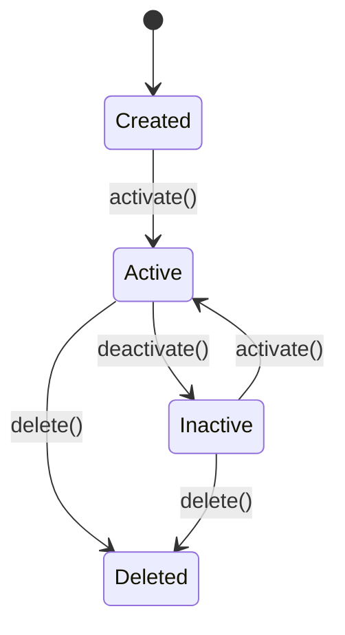

# Spec

## 목적

기획(planning.md)을 코드로 변환하기 전, 기술 스펙을 명확히 정의

## 순서

```
planning.md (왜? 뭘?)
    ↓
spec.md (어떻게? 인터페이스/타입)
    ↓
tdd.md (테스트 작성)
    ↓
개발
```

---

## 1. 인터페이스/타입 정의

코드 작성 전 타입 먼저 정의:

```typescript
// 입력
interface CreateUserInput {
  email: string;
  password: string;
  name?: string;
}

// 출력
interface CreateUserOutput {
  success: boolean;
  user?: User;
  error?: ErrorInfo;
}

// 도메인 타입
interface User {
  id: string;
  email: string;
  name: string;
  createdAt: Date;
}
```

**왜?**
- 스펙이 곧 코드가 됨
- AI가 정확한 타입으로 구현
- 테스트 작성 시 타입 활용

---

## 2. 에러 코드 정의

```typescript
// 에러 타입
interface ErrorInfo {
  code: ErrorCode;
  message: string;
}

// 에러 코드
type ErrorCode =
  | 'INVALID_INPUT'
  | 'DUPLICATE_EMAIL'
  | 'NOT_FOUND'
  | 'UNAUTHORIZED'
  | 'TIMEOUT';

// 에러 메시지 매핑
const ERROR_MESSAGES: Record<ErrorCode, string> = {
  INVALID_INPUT: '입력값이 올바르지 않습니다',
  DUPLICATE_EMAIL: '이미 등록된 이메일입니다',
  NOT_FOUND: '찾을 수 없습니다',
  UNAUTHORIZED: '권한이 없습니다',
  TIMEOUT: '요청 시간이 초과되었습니다',
};
```

---

## 3. 테스트 케이스 → 테스트 코드

planning.md 테스트 케이스를 실제 코드로 변환:

**planning.md:**
```markdown
**Happy Path**:
- [ ] 정상 입력 → 사용자 생성 성공

**Edge Cases**:
- [ ] 이메일 중복 → DUPLICATE_EMAIL 에러

**Error Cases**:
- [ ] 잘못된 이메일 형식 → INVALID_INPUT 에러
```

**테스트 코드:**
```typescript
describe('createUser', () => {
  // Happy Path
  it('정상 입력 → 사용자 생성 성공', async () => {
    const input: CreateUserInput = {
      email: 'test@example.com',
      password: 'password123',
    };
    const result = await createUser(input);
    expect(result.success).toBe(true);
    expect(result.user).toBeDefined();
  });

  // Edge Case
  it('이메일 중복 → DUPLICATE_EMAIL 에러', async () => {
    const input: CreateUserInput = {
      email: 'existing@example.com',
      password: 'password123',
    };
    const result = await createUser(input);
    expect(result.success).toBe(false);
    expect(result.error?.code).toBe('DUPLICATE_EMAIL');
  });

  // Error Case
  it('잘못된 이메일 형식 → INVALID_INPUT 에러', async () => {
    const input: CreateUserInput = {
      email: 'invalid-email',
      password: 'password123',
    };
    const result = await createUser(input);
    expect(result.success).toBe(false);
    expect(result.error?.code).toBe('INVALID_INPUT');
  });
});
```

---

## 4. 상태 다이어그램 (선택)

복잡한 상태 전이가 있는 경우:

```
[생성됨] → [활성화] → [비활성화] → [삭제됨]
              ↑______________|
```

또는 Mermaid 형식:



---

## 체크리스트

- [ ] 입력/출력 인터페이스 정의했는가?
- [ ] 에러 코드와 메시지 정의했는가?
- [ ] 테스트 케이스를 테스트 코드로 변환할 수 있는가?
- [ ] 상태 전이가 있다면 다이어그램을 그렸는가?

---

## 다음 단계

스펙 정의 완료 → tdd.md의 RED 단계로 진행
